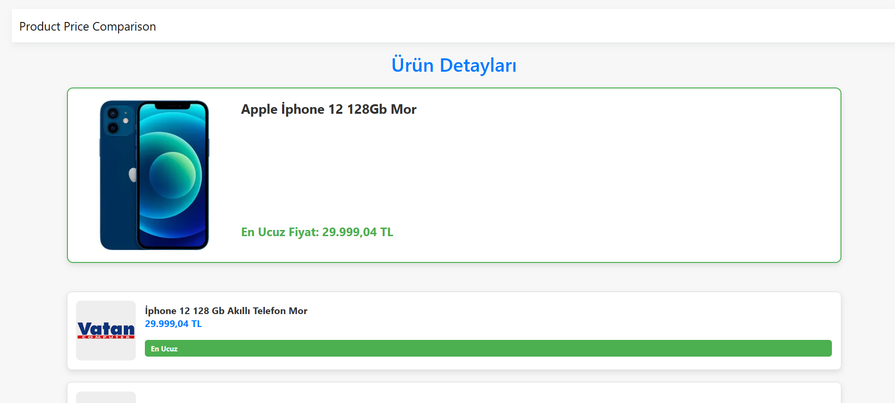

# Price Comparison Website

This project is a **price comparison website** developed using the **MVC .Net framework**. It collects pricing data from various websites through web scraping and presents the best deals to users. Tools like **Chrome Driver**, **Selenium**, and **HTML Agility Pack** were used for web scraping. On the frontend, **Bootstrap** was used to design a user-friendly interface.

## Features

- Collect pricing data from multiple websites using web scraping.
- Compare product prices and list the best deals.
- User-friendly and responsive interface.
- Search and filter products across various categories.
- Display dynamic and up-to-date pricing information.

## Technologies Used

### Backend
- **ASP.NET MVC**: The core architecture of the project.
- **C#**: The language used for backend development.
- **HTML Agility Pack**: A library used to scrape data from websites.
- **Selenium**: Used to scrape dynamic content from websites.
- **Chrome Driver**: Works with Selenium to automate browser interactions.

### Frontend
- **Bootstrap**: Used for a modern, responsive, and user-friendly design.
- **CSS**: For custom styling needs.

## Screenshots

### Homepage

### Results Page

